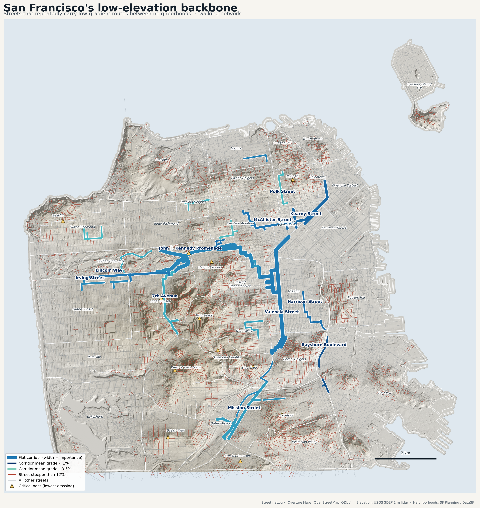

# San Francisco Flat Routes

Finding the city's hidden network of relatively flat streets: the routes that
connect San Francisco's neighborhoods while climbing as little as possible.



San Francisco is famously hilly, but it is hilly in a *structured* way. Its
hills are separated by valleys, saddles and old dune flats, and those low
places join up into a network that is far more continuous than the city's
reputation suggests. This project models that network from authoritative
elevation and street data, routes across it under several competing
definitions of "flat", and then works out which streets the city's geography
forces low-gradient traffic onto.

**The central result: about 14% more walking buys about 39% less climbing.**
Averaged over all 1,260 ordered neighborhood pairs, the minimum-climbing
pedestrian route is only 14% longer than the shortest one, yet avoids 39% of
the ascent and drops the typical steepest pitch from 27% to 17%.

The full write-up is in **[`outputs/findings.md`](outputs/findings.md)**, and
the checks against known ground truth are in
**[`outputs/validation_report.md`](outputs/validation_report.md)**.

## What it produces

| Output | What it is |
|---|---|
| [`outputs/sf_flat_routes_map.html`](outputs/sf_flat_routes_map.html) | Interactive map with a working routing UI (origin, destination, mode, preference), per-route metrics and elevation profiles. Self-contained: Leaflet is embedded, so it works offline apart from the optional basemap tiles. |
| [`outputs/sf_flat_backbone.png`](outputs/sf_flat_backbone.png) / `.pdf` | Publication-quality static map of the low-elevation backbone, over a hillshade computed from the same lidar the analysis uses. |
| [`outputs/sf_street_grades.png`](outputs/sf_street_grades.png) | Citywide street-gradient map. |
| [`outputs/findings.md`](outputs/findings.md) | Written analysis of the major findings. Every figure is generated from the outputs, not typed in. |
| [`outputs/validation_report.md`](outputs/validation_report.md) | Validation against an independent DEM, documented street gradients and known flat corridors. |
| `outputs/flat_corridors.geojson` / `.gpkg` / `.csv` | The discovered low-elevation corridors: street names, endpoints in lon/lat, neighborhoods connected, length, elevation range, gradient and importance metrics. |
| `outputs/neighborhood_pairs.csv` | 10,080 routes: every ordered neighborhood pair × 4 objectives × 2 modes, with full metrics. |
| `outputs/pareto_frontier.csv` | Distance / climbing / peak-gradient trade-off frontiers. |
| `outputs/passes.geojson` / `.csv`, `outputs/pass_matrix.csv` | Critical passes, and the lowest possible crossing elevation for every neighborhood pair. |
| `outputs/barriers.geojson` / `.csv` | Steep streets that inter-neighborhood traffic cannot avoid. |
| `outputs/lowland_basins.geojson` | The city's flat districts, delineated below 15 m. |
| `data/processed/sf_street_network.gpkg` | Processed street network as a GeoPackage, ready to open in QGIS or ArcGIS: 87,776 edges with gradient, climbing and access attributes. |
| `data/processed/edges_metrics.parquet`, `edges_directed.parquet` | The same network as Parquet, plus the full per-direction metric table (175,552 directed edges). |

## Headline findings

- **Two spines carry the city.** The Mission valley floor (Valencia–Guerrero–
  Market–16th, 6.9 km at 1.3% mean gradient) runs north–south; the
  Wiggle–Panhandle–Golden Gate Park chain (7.6 km) runs east–west. The
  analysis was not told either existed.
- **The Wiggle emerges unprompted.** Asked for a flat bicycle route from
  Market at Duboce to Haight at Masonic, the model returns the Wiggle: 0.4 m
  of *excess* climbing against the shortest route's 19.0 m, for 2% more
  distance. Both routes must gain the same 18 m; the Wiggle simply does not
  waste any of it.
- **One pass dominates the city.** An unnamed path in Golden Gate Park at
  ~255 ft is the binding constraint for 119 of 630 neighborhood pairs — the
  lowest point on the ridge dividing the eastern flats from the ocean side.
  Crossing San Francisco east–west costs that 255 ft whatever you do.
- **Twin Peaks has no cheap way over it.** The lowest crossings into West of
  Twin Peaks and Diamond Heights are Lansdale Avenue (696 ft) and Panorama
  Drive (635 ft). These neighborhoods are the ones the flat network cannot
  reach.
- **Total climbing and peak steepness are different objectives.** The
  grade-averse route climbs *more* in total than the flattest route (325 ft
  vs 281 ft) while holding the steepest pitch to 10.8% instead of 17.2%. No
  single definition of "flat" serves both.

## Methodology

### Elevation

Elevation accuracy drives everything else, so the method is deliberate.

1. **Source.** USGS 3DEP **1 m bare-earth lidar**, project
   `CA_SanFrancisco_B23` — four cloud-optimised GeoTIFF tiles in
   EPSG:26910 (NAD83 / UTM 10N), which is also the CRS used for every length
   and slope computation. No raster reprojection is ever performed.
2. **Noise suppression, spatially.** A Gaussian filter of σ = 3 m is applied
   to the DEM before sampling. Bare-earth lidar still contains
   decimetre-scale artefacts from curbs, parked vehicles, vegetation
   misclassification and interpolation over occlusions. σ = 3 m is far
   narrower than a San Francisco street (15–25 m kerb to kerb) and far
   narrower than the ~100 m block scale on which real street gradient varies.
3. **Sampling at 5 m.** Chosen empirically. At 10 m spacing the short steep
   pitches that give the city its reputation were measurably clipped —
   Bradford Street read 36.8% against a documented 41%, Prentiss Street 32.9%
   against 37% — while sampling at 5 m returns 41.4% and 36.9% respectively
   before smoothing.
4. **Structures.** Where an edge is flagged `is_bridge` or `is_tunnel` the DEM
   describes the ground or water *under* the deck. Such edges get a linear
   ramp between their endpoints; endpoints that are themselves unreliable
   (mid-viaduct nodes) are recovered by solving a discrete Laplace problem
   over the structure sub-graph with the reliable nodes as boundary
   conditions — the deck is modelled as the smoothest ramp consistent with
   where it meets the ground.
5. **Smoothing per street segment, not per edge.** A Savitzky–Golay filter
   (order 2, ~50 m window) is applied to the *concatenated* profile of each
   contiguous run of a street segment. Smoothing edges in isolation gave the
   two edges either side of an intersection different elevations for the same
   corner, and in San Francisco that happens every 80 m.
6. **One elevation per intersection.** Each node is reconciled to a single
   elevation and every profile is rubber-sheeted onto it with a linear
   correction (0.02 m on average). This makes per-edge climbing sum *exactly*
   to the difference between a route's endpoints.
7. **Dead-band on cumulative gain.** Cumulative gain and loss are computed
   after pruning every elevation reversal smaller than 0.5 m. Pruning
   replaces a run by its **monotone envelope** clamped to the run's
   endpoints, so an oscillation below the dead-band contributes no gain at
   all, while a genuine sustained climb is preserved to the millimetre *and
   the shape within the run is preserved* — which is what makes per-edge
   figures additive along a route.

The last two points matter more than they sound. Two earlier
implementations were measurably wrong and are kept as regression tests: a
backlash-operator dead-band charged one dead-band per edge and lost 17 m of
real climbing on a route over Twin Peaks, and a linear-interpolation
rectifier redistributed climbing within a segment with errors reaching 51 m.

**Validation** (full report in
[`outputs/validation_report.md`](outputs/validation_report.md)):

- Against the independent USGS 1/3 arc-second DEM at 4,000 random points:
  mean difference −0.02 m, RMS 0.68 m, 98.5% within 2 m.
- Against documented street gradients: 6 of 8 within 5 percentage points
  (Filbert 32.9% vs 31.5%, Jones 31.1% vs 29.0%, 22nd Street 32.6% vs 31.5%,
  Baden 34.5% vs 32%, Duboce 28.8% vs 27.5%). Of the two that miss, Nevada
  Street is a *classification* issue — its published 35% pitch is tagged
  `steps` in OpenStreetMap and measures 34.6% as a stairway — and Bradford
  Street is smoothing attenuation, discussed under Limitations. The model was
  not changed to fit either.
- The Embarcadero and the Great Highway, the city's two genuinely level
  corridors, come out at ~1.1 m of climbing per km. Jones Street comes out at
  39 m/km. That is a 37× separation.
- Internal invariants asserted in the test suite: per-edge
  `gain − loss == net_change` holds to 0.0 for all 175,552 directed edges,
  and no node has an inconsistent elevation.

### Street network

Overture Maps' transportation theme (OpenStreetMap-derived, ODbL). Topology
comes from Overture **connectors**: every segment lists the connector IDs it
touches with the fractional position along its own geometry, so splitting at
those positions and keying nodes by connector ID gives exact topology with no
snapping tolerance, and grade-separated crossings correctly stay
unconnected.

Reading it is cheap despite the theme being ~64 GB: Parquet row-group
statistics on the `bbox` column mean only **7 of 16,384 global row groups**
intersect San Francisco, so the extract takes seconds and ~10 MB.

Access is derived from Overture `access_restrictions`, whose rule shapes in
San Francisco are `denied` + `heading=backward` (one-way, 7,034 segments),
per-mode `denied`/`allowed`/`designated`, and `as_private` /
`at_destination` conditional access. One-way is enforced for bicycles and
ignored for pedestrians, since OSM `oneway` describes vehicle movement;
contraflow bicycle lanes are honoured.

Two classification facts shaped the mode filters, both verified against the
data rather than assumed:

- `trunk` includes **Van Ness Avenue, 19th Avenue, Lombard Street and part of
  Mission Street** — ordinary surface streets with sidewalks. `trunk`
  therefore *cannot* be excluded from walking or cycling.
- `motorway` is true grade-separated freeway and is excluded.
- `steps` (2,722 edges, 36 km) is a real part of the pedestrian network and is
  **excluded outright for bicycles**. A route suitable for a pedestrian is
  emphatically not necessarily rideable.
- `sidewalk` and `crosswalk` subclasses are excluded for both modes: travel is
  modelled along street centrelines, because including the sidewalk network
  would represent every street two or three times and wreck corridor
  aggregation.

### Routing model

Edge cost, in "equivalent metres" — the distance a traveller would consider
as bad as this edge:

```
cost = length × mode_multiplier(class)
     + α × cumulative_gain
     + β × Σₖ penaltyₖ × distance_above_thresholdₖ
     + γ × extreme_extra × distance_above_highest_threshold
```

The threshold terms are **cumulative**: 100 m at 12% incurs the 3%, 5%, 8%
and 10% penalties simultaneously, so the marginal cost of steepness rises
super-linearly rather than staying flat. `α` is the substitution rate between
climbing and distance — Naismith's rule for walking implies about 8 m of flat
walking per metre climbed.

Only `cumulative_gain` ever enters the cost, never net elevation change. A
route that climbs 120 m and descends 120 m has zero net change and is not
flat; that is the analytical point of the project, and it is asserted in the
test suite.

Four objectives, all configured in [`sf_flat_routes/config.py`](sf_flat_routes/config.py):

| Objective | α | β | γ | Intent |
|---|---|---|---|---|
| `shortest` | 0 | 0 | 0 | distance only (comfort multipliers off, so it is a true baseline) |
| `min_climb` | 120 | 0 | 0 | near-lexicographic preference for avoiding ascent |
| `grade_averse` | 4 | 12 | 6 | steep *segments* dominate; total ascent secondary |
| `balanced` | 14 | 2 | 2 | flat but without absurd detours |

Bicycle costs additionally carry stress weights (protected cycleway 0.85,
19th Avenue and Van Ness 1.9) and respect one-way restrictions. These are
switched **off** for `shortest`, so that every distance-penalty and
elevation-saved figure is measured against a genuine shortest path.

### Corridor detection

A street earns corridor status by being *used*, repeatedly, by good flat
routes between different parts of the city, and by saving climbing when used.
For each edge the analysis accumulates, over every ordered neighborhood pair
and every climb-averse objective: the number of distinct pairs served, the
number of distinct neighborhoods at either end (which separates a citywide
corridor from a street busy between one pair of districts), and the climbing
avoided versus the shortest path, apportioned by the edge's share of route
length. Edges whose own gradient disqualifies them as flat are excluded
regardless of usage, so the unavoidable climbs *out* of a corridor do not get
absorbed into it. Contiguous high-scoring edges are then merged, short gaps
are closed, and the result is labelled by its constituent street names.

### Passes and barriers

"How much climbing is unavoidable between these two parts of the city?" is a
**minimax (bottleneck) path** problem, not a shortest-path problem:

```
pass_height(s,t) = min over paths P from s to t of ( max elevation on P )
```

This has an exact solution. Sorting every edge by its crest and adding edges
to a union-find structure in increasing crest order builds a minimum
bottleneck spanning tree; the crest of the edge that first connects `s` to
`t` *is* `pass_height(s,t)`, and the lowest common ancestor in the resulting
merge tree answers every pair from one construction. The result was checked
against the routing: the maximum elevation reached on the minimum-climbing
route is at or above the computed pass height for **all 1,260 pairs, with
zero violations**.

Barriers are the complementary view: steep edges carrying heavy
shortest-path traffic. One that keeps its traffic under the climb-averse
objectives has no alternative; one that loses it does.

### Neighborhood access points

A polygon centroid can land in a park, on a cliff, in the water, or outside a
concave neighborhood entirely. Instead, each neighborhood's representative
point is the **street-length-weighted centre** of its network nodes — street
length being a far better proxy for where journeys start than polygon area —
snapped to the nearest qualifying intersection (degree ≥ 3, named street, of
an ordinary urban class). The offset from the geometric centroid is recorded
for audit; only Lakeshore (453 m, Lake Merced is water) and the Presidio
(444 m) exceed 400 m.

## Data sources

All URLs verified 2026-09-16. `python -m sf_flat_routes sources` prints the
full table with limitations.

| Dataset | Publisher | Resolution / vintage | Licence | Role |
|---|---|---|---|---|
| Overture Maps transportation segments & connectors, release `2026-08-19.0` | Overture Maps Foundation (derived from OpenStreetMap) | Vector; OSM-equivalent accuracy (~1–5 m) | ODbL 1.0; schema CDLA-Permissive 2.0 | Routable street network: geometry, class, per-mode access, bridge/tunnel flags, topology |
| USGS 3DEP 1 m bare-earth DEM, project `CA_SanFrancisco_B23` | USGS 3D Elevation Program | 1 m GSD, EPSG:26910, metres above NAVD88 | Public domain | Primary elevation source |
| USGS 3DEP 1/3 arc-second DEM, tile `n38w123` | USGS 3D Elevation Program | ~10 m, EPSG:4269 | Public domain | Independent cross-check only |
| San Francisco neighborhoods (37-unit planning set) | SF Planning / DataSF, mirrored by Code for America | 37 polygons | Open data | Neighborhood boundaries |
| Bicycle facilities / low-stress streets | Derived from Overture/OSM attributes | Vector | ODbL 1.0 | Bicycle overlay (see limitations) |

### Two substitutions, and why

`data.sfgov.org` and `sfgov.org` are **blocked by the build environment's
network egress policy**, so two datasets could not be fetched from their
authoritative source:

1. **Neighborhood boundaries.** The official 41-unit *Analysis Neighborhoods*
   product could not be downloaded. This project uses the long-standing
   37-unit San Francisco planning neighborhood set via the Code for America
   `click_that_hood` mirror — a real, widely used SF boundary set whose union
   is 122.0 km² against the city's ~121 km² land area. The two products
   differ mainly in how the Sunset, Richmond and Twin Peaks areas are
   subdivided, which affects representative-point placement but not the
   street model. The mirror does not state its boundary vintage.
2. **SFMTA bikeway network and Slow Streets.** Not retrievable. The bicycle
   and low-stress layers are instead derived from Overture/OSM attributes
   (`class=cycleway`, `living_street`, `pedestrian`, bicycle-designated
   paths). OSM bicycle tagging in San Francisco is largely conflated with
   SFMTA data by local mappers, so this is a good proxy — but it is **not
   authoritative**, and it carries no SFMTA facility class (I/II/III/IV) and
   no official Slow Streets designation.

Both substitutions are recorded in the dataset registry and flagged
`[SUBSTITUTED]` by `python -m sf_flat_routes sources`.

## Installation

Python 3.10+.

```bash
git clone <this repo> && cd minihill
python -m venv .venv && source .venv/bin/activate
pip install -r requirements.txt        # or: pip install -e ".[dev]"
```

The geospatial stack (GeoPandas, rasterio, pyproj, shapely, scipy, networkx,
pyarrow) installs from wheels; no system GDAL is required.

## Reproducing the analysis

```bash
python -m sf_flat_routes all            # everything, in order
```

Or stage by stage — each caches its output, so re-running is cheap:

```bash
python -m sf_flat_routes sources        # dataset provenance table
python -m sf_flat_routes download       # fetch and cache source data (~725 MB)
python -m sf_flat_routes build-network  # street graph, elevation, edge metrics
python -m sf_flat_routes analyze        # pairs, Pareto, corridors, passes
python -m sf_flat_routes validate       # checks against known ground truth
python -m sf_flat_routes map            # interactive + static maps
python -m sf_flat_routes report         # written analysis
```

Add `--force` to recompute a stage instead of using its cache. Ad-hoc
routing:

```bash
python -m sf_flat_routes route --from Mission --to "Outer Sunset"
python -m sf_flat_routes route --from "Inner Richmond" --to Downtown/Civic\ Center --mode bike
```

```
Mission  ->  Outer Sunset   [walk]
objective        miles  climb ft  loss ft  max %   >5% m   >8% m            vs shortest
shortest          5.10      1130      955   59.9    2677    1303
min_climb         6.22       333      158    9.2     211       1   +22% dist,   +797 ft climb
grade_averse      6.38       349      174    7.0       3       0   +25% dist,   +781 ft climb
balanced          6.20       345      170    7.0      29       0   +21% dist,   +785 ft climb
```

A full clean run takes about **6 minutes** on 4 cores and completes with no
warnings: ~55 s to download and cache 725 MB of source data, ~1 m 40 s to
build the street graph and sample 1.6 M elevation points, ~30 s for the
routing analysis (10,080 routes), ~15 s to validate, and ~2 m 35 s to render
the maps. Re-running any stage from cache is near-instant.

### Tests

```bash
python -m pytest tests/ -q             # 93 tests
```

Covering grade computation, cumulative elevation gain (dead-band behaviour,
additivity, exact directional symmetry), directional edge costs, the routing
cost model, access-rule interpretation, the minimax pass algorithm, corridor
scoring, and polyline/hillshade helpers — plus integration tests that assert
the model's invariants against the real processed data.

## Project structure

```
sf_flat_routes/
  config.py           all tunable parameters: CRS, weights, thresholds, modes
  sources.py          dataset registry: URLs, dates, licences, limitations
  download.py         cached acquisition; Parquet row-group bbox pruning
  network.py          street graph from Overture segments + connectors
  elevation.py        DEM mosaic, sampling, smoothing, structure handling
  metrics.py          per-directed-edge metrics: grades, gain, steep distance
  routing.py          cost model and scipy-backed shortest paths
  neighborhoods.py    boundaries and representative access points
  pairs.py            neighborhood-pair matrix and Pareto frontiers
  corridors.py        corridor importance scoring and merging
  passes.py           minimax passes, lowland basins, barriers
  validate.py         checks against known ground truth
  viz_static.py       publication maps (matplotlib + lidar hillshade)
  viz_interactive.py  self-contained Leaflet map with routing UI
  report.py           generates outputs/findings.md from the outputs
  pipeline.py         stage orchestration
  __main__.py         CLI
  vendor/             Leaflet 1.9.4 (BSD-2-Clause), inlined into the map
notebooks/            exploration only; the analysis runs from the CLI
tests/                93 tests
data/raw/             cached source data (never modified)
data/processed/       cached intermediate products
outputs/              deliverables
```

Raw data is never written to; every expensive product is cached and
recomputed only with `--force`.

## Limitations

Beyond the two dataset substitutions above:

- **Elevation is the ground, not the road surface.** Bridges and tunnels are
  interpolated; a handful of piers over water are solved from neighbours.
- **Travel is on street centrelines.** Pedestrian distances are block-scale,
  not door-to-door, and sidewalk-level detail is deliberately unused.
- **Maximum gradient on short edges is unreliable.** Over a 5 m stub a single
  decimetre of artefact reads as 20%; the worst real case found was a 5 m
  connector at Market and 5th reporting 41%. Edges under 15 m are flagged and
  excluded from maximum-gradient tests, which fall back to average gradient.
  41,330 of 87,776 edges are long enough to carry a reliable maximum.
- **One access point per neighborhood.** Large or awkward neighborhoods
  (Bayview, Lakeshore, the Presidio) are served worse than compact ones.
- **No traffic, signals, surface quality or safety.** The bicycle stress
  weights are a proxy for road class, not a level-of-traffic-stress model.
- **Gradients are attenuated at the extremes.** Published "steepest street"
  figures are measured over the single steepest pitch, sometimes only 15–20 m
  long, and the smoothing chain costs roughly eight percentage points there.
  Bradford Street shows the whole chain: 41.4% sampled raw at 5 m against a
  published 41%, 36.8% raw at 10 m, 36.9% with the 50 m window applied within
  the edge, and 33.1% as the pipeline computes it (smoothed across whole
  segments and reconciled at intersections). The trade is deliberate: with
  less smoothing, lidar artefacts pushed 22nd Street and Baden Street to the
  60% plausibility ceiling. For a project about *flat* routes, clipping the
  peak of a 41% wall is a much cheaper error than inventing gradient on flat
  ground.
- **The interactive map's routes are precomputed**, between neighborhood
  access points only. It cannot route from an arbitrary clicked point,
  because a static HTML file cannot run Dijkstra.
- **Treasure Island / Yerba Buena Island** are excluded from pair routing:
  they are part of San Francisco but have no pedestrian access across the
  western span of the Bay Bridge.

## Licence and attribution

Analysis code in this repository is available under the MIT licence. The data
it consumes is not: street geometry is **© OpenStreetMap contributors,
ODbL 1.0** (via Overture Maps), and any redistribution of derived street
geometry — including `outputs/flat_corridors.geojson`,
`data/processed/edges_*.parquet` and the interactive map — carries ODbL
share-alike obligations. USGS 3DEP elevation is public domain. Leaflet is
bundled under BSD-2-Clause; see
[`sf_flat_routes/vendor/README.md`](sf_flat_routes/vendor/README.md).
