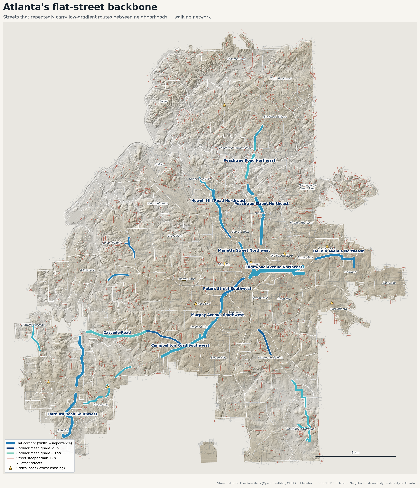
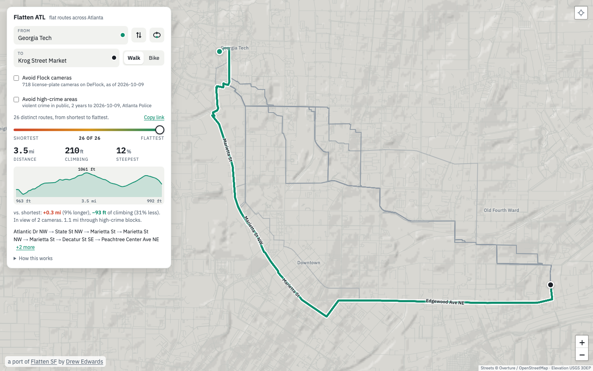
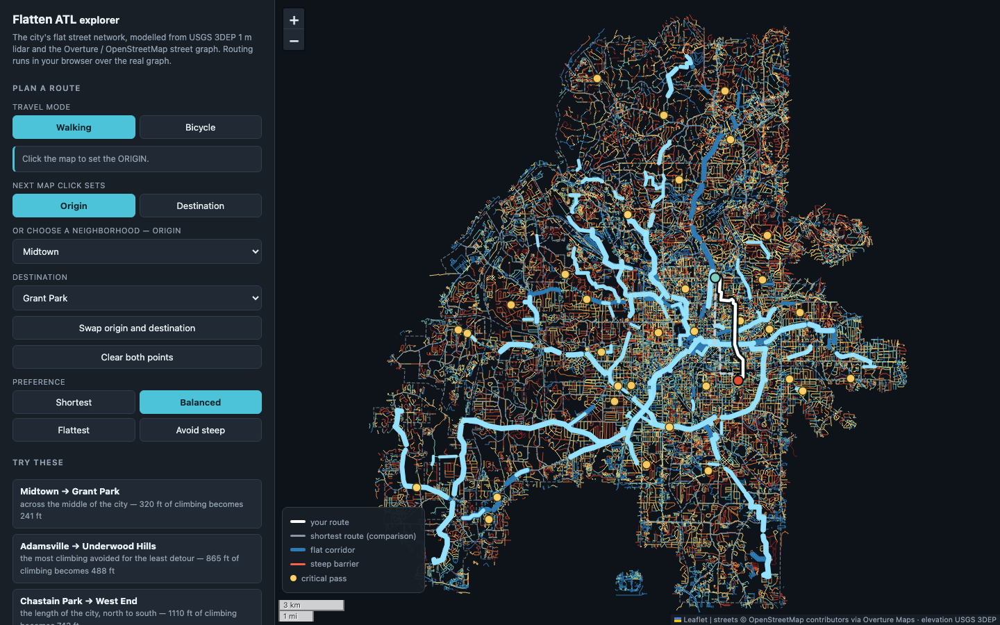
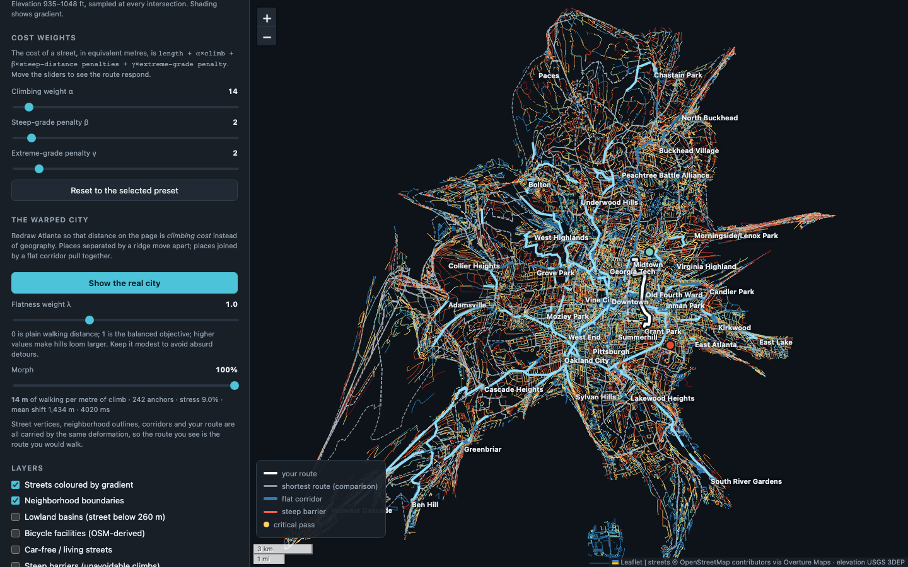

# flattenatl

**[broyojo.com/flattenatl](https://broyojo.com/flattenatl/)**: the flattest
route between any two places in Atlanta, and every route between it and the
shortest.

A port of [flattensf](https://github.com/almostimplemented/flattensf)
([flattensf.com](https://flattensf.com/)) by Drew Edwards, from San
Francisco to Atlanta: the same route finder and the same analysis, rebuilt
on Atlanta's streets and lidar. The Python package keeps its upstream name,
`sf_flat_routes`, so that upstream changes still merge.



Atlanta is not San Francisco. Its hills are not walls with flats between
them; it is a plateau cut by creeks, and it was laid out along its ridges,
because that is where the railways found an easy grade. This project models
the street network from authoritative elevation and street data, routes
across it under several competing definitions of "flat", and then works out
which streets the city's geography pushes low-gradient traffic onto.

**The central result: about 7% more walking buys about 19% less climbing.**
Averaged over 1,260 ordered pairs of neighborhoods, the minimum-climbing
pedestrian route is 7% longer than the shortest one and avoids 19% of the
ascent. San Francisco's figures, from the same method, are 14% and 39%:
rolling ground gives a flat route less to work with than hills you can walk
around.

The full write-up is in **[`outputs/findings.md`](outputs/findings.md)**, and
the checks against known ground truth are in
**[`outputs/validation_report.md`](outputs/validation_report.md)**.

## The route finder

**Live: [broyojo.com/flattenatl](https://broyojo.com/flattenatl/)**

Type where you are and where you are going, then drag the slider from
**shortest** to **flattest** and watch the route change. The slider steps
through every route that no other route beats on both distance and
climbing, solved in your browser over the full street graph: sliding right
never shortens the route and never adds climbing. The numbers, the
elevation profile and the list of streets follow along, street names are
drawn on the route itself, and the faint lines are the other routes in the
family, so you can see where they agree and where they part.

It opens on Georgia Tech to Krog Street Market, on foot: 3.2 miles and
303 ft of climbing by the shortest way, 3.5 miles and 210 ft by the
flattest, which goes down Marietta Street and out Edgewood Avenue along the
old railway ridge, with two dozen routes in between.

On a bike, **prefer calm streets** (on by default) measures distance in
comfort rather than feet: a block with a protected lane or a trail from the
Atlanta Regional Commission's facility inventory counts as 0.8 of its
length, a quiet street as 1, a busy arterial without a lane as 1.4 to 2.
The climbing axis is untouched, so the slider still runs from the shortest
comfortable ride to the flattest. Untick it and the shortest end is the
genuine shortest path.

The **loop button** next to swap turns the trip into a run or ride that
starts and ends in the same place. The slider becomes the loop's length
(1 to 15 miles), and the page tries dozens of loops of about that length
in every direction: out to one, two or three turning points (always a
real intersection) and home by other streets, avoiding any street within
a block of the way out, and optionally an out-and-back in each direction
(the flattest way to a turnaround half the distance away, and back).
Loops that double back on themselves without being an out-and-back, or
are too thin to be a loop, are dropped, and the flattest of the rest is
shown, with how much less it climbs than a typical loop of the same length
from the same start. Out-and-backs are left out unless *Allow out and back*
is ticked; near the BeltLine they usually win.

**Avoid Flock cameras** keeps the route out of view of every automated
license plate reader on [DeFlock](https://deflock.me), the crowd-sourced
map: about 720 of them watch a street inside the city, nine in ten made by
Flock Safety, and all makes are avoided. It comes before everything else.
With the box ticked the slider runs only over routes in view of no camera,
from the shortest of those to the flattest. Where no route is clear, the
page finds the one that passes the fewest, and the slider runs over routes
that pass only those cameras, which are ringed on the map. Nothing about
cameras is drawn unless the box is ticked, and then only the ones a route
could not avoid; the line under the figures says how many cameras a route
is in view of either way.

From Georgia Tech to Krog Street Market the plain routes pass two to six
cameras and the camera-free ones swap Edgewood Avenue for Auburn, for a
fifth of a mile. From Five Points to Lenox Square the plain routes pass 8
to 25; with the box ticked every route passes one, beside the mall, that
cannot be avoided.

**Avoid high-crime areas** works the same way with a different map: the
blocks with the most reported violent crime in public places over the last
two years, from the Atlanta Police Department's incident reports. They are
4% of the city's street length, about a third of Downtown and a fifth of
Midtown and West End among them. Those blocks are closed first; where a
trip starts or ends among them, the way through that spends the least
distance on them is used, and that stretch is marked. From Georgia Tech to
Krog Street Market the flattest plain route spends 1.1 miles on such
blocks and the avoiding ones none; from Georgia Tech into Five Points
station 450 ft cannot be avoided. Both boxes can be ticked together.

**Follow me**: the target button on the map puts a dot where you are,
with an arrow for the way you are facing, and keeps the map on you as you
walk. Drag the map to look elsewhere and tap the button to come back; tap
it while following to turn it off. On a phone the card folds down to the
trip and its figures while the dot is up. The position stays on the phone,
the heading is the compass where there is one and otherwise the direction
of the last few metres, and the screen is kept awake where the browser
allows. The map stays north-up, and there is no turn-by-turn: it is the
route with a "you are here" on it.



Place search is **offline**: street intersections ("10th & Peachtree"),
addresses ("675 Ponce de Leon") and about 17,000 parks, landmarks, stations,
schools, restaurants, shops, gyms and other everyday places are built into
the page from the street graph and Overture's places, addresses and base
themes. No geocoding API, so no key
to leak and nothing to pay for. You can also click the map, or drag either
pin. "Copy link" gives a URL that reopens the exact trip.

Atlanta street names come with a quadrant, and the search treats
"10th St NE", "10th Street Northeast" and "10th" as the same street. Where
a name is shared (Ponce de Leon Avenue, Place, Court, Manor), the street
that actually has the house number comes first. An address can be pasted
whole ("650 Ponce De Leon Ave NE, Atlanta, GA 30308"), may be on a numbered
street ("22 14th St NW"), and "MLK" finds Martin Luther King Jr Drive.

A chain is listed once per branch, each with its street and neighborhood,
nearest first: nearest to the other end of the trip if there is one,
otherwise to the middle of the map. There are four Whole Foods inside the
city, and the one you mean is rarely the one in Buckhead.

**Routes stay inside the Atlanta city limits.** The limits are ragged, and
they leave out places many people think of as Atlanta: Decatur, most of
Druid Hills, East Point, Sandy Springs, Vinings, nearly all of the airport.
A click out there snaps to the nearest street inside the city, and a route
cannot leave the city even where the flat way round would.

The site is static: [`site/`](site/) holds the page, its CSS and JS, the
whole street graph as one 6.0 MB gzipped file and the hillshade as a PNG,
and GitHub Pages serves it as is. After the first load every route is
solved locally. The same page is also written as one self-contained 8 MB
file,
[`outputs/atl_flat_route_finder.html`](outputs/atl_flat_route_finder.html),
which opens straight from disk.

### The explorer

[`outputs/atl_flat_routes_map.html`](outputs/atl_flat_routes_map.html) is the
working view of the analysis: the network coloured by gradient, the
discovered corridors, passes, barriers and basins as toggleable layers, the
four objectives with live α/β/γ sliders, a Pareto readout, and the warped
city below. It is dense by design.



The thick pale blue lines are the flat corridors the analysis discovered;
the yellow dots are the passes. The explorer draws on a plain dark
background: upstream used CARTO's dark basemap, which now answers every
request with an "API key required" tile.

### The warped city



The map can also redraw the city so that distance on the page means
**climbing cost** rather than geography. Places separated by a ridge move
apart; places joined by a flat corridor pull together. In Atlanta the far
movers are the corners of the city: Midwest Cascade shifts almost 7 km and
South River Gardens over 2 km, each behind a creek valley and a neck in the
city limits, while Grove Park and Mozley Park, in the middle of the west
side's street grid, move a few hundred metres.

The deformation is driven by the same cost model as the routes, with one
knob: how many metres of walking a metre of climb is worth. At λ = 0 the
page shows plain network distance, λ = 1 is the balanced objective, and
higher values make the hills loom larger. A morph slider runs the real city
into the warped one.

Method: about 240 anchor intersections (every analysis neighborhood's access
point plus a 1.5 km lattice snapped to routable nodes) get a full cost
matrix from the in-page router; stress majorisation (SMACOF, unit weights)
lays them out so page distance matches cost, starting from their true
positions so the result is the least deformation that fits; a Procrustes
fit turns and scales the layout back onto geography so north stays up; and
a thin-plate spline through the anchors' displacements carries every street
vertex, neighborhood outline, corridor and route along with it. It takes
about three seconds in the browser, so the weight can be changed live. The
spline extrapolates freely past the outermost anchors, so the ragged edges
of the city are drawn out into spikes; read the middle, not the fringe.

## What it produces

| Output | What it is |
|---|---|
| [`outputs/atl_flat_route_finder.html`](outputs/atl_flat_route_finder.html) | The route finder: origin, destination, walk or bike, and a slider from the shortest route to the flattest, with offline place search. Self-contained: Leaflet, the whole 205,000-arc graph, the place index and a lidar hillshade are embedded. This is the page to share. |
| [`site/`](site/) | The route finder as a static site (the same page with the graph and hillshade as separate cacheable files), deployed to GitHub Pages by `.github/workflows/pages.yml`. |
| [`outputs/atl_flat_routes_map.html`](outputs/atl_flat_routes_map.html) | The explorer: every analysis layer, the four objectives with live α/β/γ sliders, Pareto readout and the warped city. Routes in the browser over the same graph. |
| [`outputs/atl_flat_backbone.png`](outputs/atl_flat_backbone.png) / `.pdf` | Static map of the flat-street backbone, over a hillshade computed from the same lidar the analysis uses. |
| [`outputs/atl_street_grades.png`](outputs/atl_street_grades.png) | Citywide street-gradient map. |
| [`outputs/screenshot_route_finder.png`](outputs/screenshot_route_finder.png), [`screenshot_interactive.png`](outputs/screenshot_interactive.png), [`screenshot_warped.png`](outputs/screenshot_warped.png) | Screenshots of the pages, regenerated by `tests/qa_screenshots.py`. |
| [`outputs/findings.md`](outputs/findings.md) | Written analysis of the findings. The figures are generated from the outputs, not typed in. |
| [`outputs/validation_report.md`](outputs/validation_report.md) | Validation against an independent DEM and known flat corridors. |
| `outputs/flat_corridors.geojson` / `.gpkg` / `.csv` | The discovered flat corridors: street names, endpoints in lon/lat, neighborhoods connected, length, elevation range, gradient and importance metrics. |
| `outputs/neighborhood_pairs.csv` | 10,080 routes: every ordered pair of the 36 analysis neighborhoods × 4 objectives × 2 modes, with full metrics. |
| `outputs/pareto_frontier.csv` | Distance / climbing / peak-gradient trade-off frontiers for every ordered pair. |
| [`outputs/sensitivity.md`](outputs/sensitivity.md) / `.csv` | Every finding recomputed under ten perturbations of the elevation parameters and access points. |
| `outputs/passes.geojson` / `.csv`, `outputs/pass_matrix.csv` | Critical passes, and the lowest possible crossing elevation for every neighborhood pair. |
| `outputs/barriers.geojson` / `.csv` | Steep streets that inter-neighborhood traffic cannot avoid. |
| `outputs/lowland_basins.geojson` | The creek valleys, delineated below 260 m. |
| `data/processed/atl_street_network.gpkg` | Processed street network as a GeoPackage, ready to open in QGIS or ArcGIS: 116,014 edges with gradient, climbing and access attributes. |
| `data/processed/edges_metrics.parquet`, `edges_directed.parquet` | The same network as Parquet, plus the full per-direction metric table (232,028 directed edges). |

## Headline findings

- **Flat means high.** Of the twelve most important flat corridors, eight
  sit above the median street elevation. They are the ridge-top streets
  beside the old railways (Edgewood and DeKalb, Marietta, Lee and Murphy,
  Whitehall and Peters) and Peachtree on its own ridge. In San Francisco
  the flat streets are the valley floors; here the valleys are creeks, and
  nobody goes far along a creek without climbing out of it.
- **The top corridor is the railway ridge through Downtown.** Edgewood
  Avenue, Peachtree Center Avenue, Decatur Street and the BeltLine's
  Southeast Trail read as one 4.8 km corridor at 1.8% mean gradient,
  serving 277 of the 1,260 ordered pairs. The analysis was not told any of
  it existed.
- **The BeltLine emerges unprompted.** Asked for a flat bicycle route from
  Glenwood Avenue at Bill Kennedy Way to Piedmont Park, the model leaves
  Boulevard, which is the shortest way and climbs 61 m, for the Southeast
  and Eastside trails: 37 m of climbing, 39% less, for 5% more distance.
- **One pass dominates.** An unnamed path in West End at 1,018 ft is the
  binding constraint for 184 of 630 neighborhood pairs. The passes are all
  between about 940 and 1,040 ft, because what has to be crossed is the
  ridge line itself: the Eastern Continental Divide runs through the city
  along the railways.
- **Climbing here is hard to avoid.** Only one pair in 1,260 can halve its
  climbing by any route. Three in ten can shed a quarter of it, at a median
  detour of 8%.
- **Total climbing and peak steepness are different objectives.** The
  grade-averse route climbs *more* in total than the flattest route (482 ft
  against 448 ft) while holding the steepest pitch to 9.4% instead of
  16.6%. No single definition of "flat" serves both.

## What changed in the port

The upstream README lists what a new city needs. This is what Atlanta took.

| | San Francisco (upstream) | Atlanta (here) |
|---|---|---|
| Projection | NAD83 / UTM 10N (EPSG:26910) | NAD83 / UTM 16N (EPSG:26916) |
| Lidar | 3DEP `CA_SanFrancisco_B23`, 4 tiles, 0.5 GB | 3DEP `GA_Statewide_2018_B18_DRRA`, 12 tiles, 3.6 GB |
| Boundary | union of 37 planning neighborhoods | City of Atlanta limits (the 248 neighborhood polygons leave 20 km² of the city unassigned) |
| Analysis units | 36 neighborhoods | 36 of the 248 official neighborhoods, at least one from each of the 25 NPUs (`config.ANALYSIS_NEIGHBORHOODS`) |
| Bike facilities | SFMTA Bike Network, downloaded by hand | Atlanta Regional Commission inventory, fetched by the pipeline |
| Lowland threshold | 15 m above sea level | 260 m contour (streets run from 230 to 330 m) |
| Validation | published gradients of famous steep streets | no published gradients exist; railway grades and the BeltLine instead |
| Network | 87,776 edges | 116,014 edges, 5,712 km |

Three things had to be built rather than re-pointed, all in the elevation
model, and all because Atlanta is crossed by freeways and railways in a way
San Francisco is not:

1. **Streets under bridges.** Lidar cannot see the ground beneath a deck,
   and the bare-earth surface there is interpolated from the embankments on
   either side. Windsor Street passes under I-20 on the level and came out
   with an 11 m hump; every underpass in the city had one. A routable edge
   that crosses another line without sharing a node with it is
   grade-separated from it, so these are found from geometry
   (`network.find_dem_gaps`): 735 edges pass under a deck, or over a
   freeway or railway the source data does not flag as bridged. The
   profile is blanked for 20 m either side of each crossing and
   interpolated along the street.
2. **Bridge approaches.** The mapped end of a bridge is rarely the
   abutment: it usually sits a few metres out over the cut, where the
   ground has already fallen away, so the approach reads as a level street
   that drops off a ledge. A deck end now takes its elevation from the
   highest point within 25 m along the approach (lowest, for a tunnel), and
   the approach's last metres are redrawn to meet it
   (`elevation.ABUTMENT_PAD_M`). Ivan Allen Jr Boulevard, Lakewood Avenue
   and Northside Drive each read 34 to 37% at a bridge end before and 5 to
   8% after. With both changes in, 7 of about 6,100 arterial blocks of 40 m
   or more read 20% or steeper.
3. **A plateau.** Everything that assumed sea level is nearby now works
   from the city's own range: the hillshade tint, the terrain colours of
   the static map, the basin threshold.

The place search changed more than the rest of the page. Upstream kept one
record per name from about a hundred of the feed's categories, which in
Atlanta left a single Whole Foods, Kroger and Starbucks for the whole city
and no restaurant filed under its cuisine. The index now keeps every branch
of a shop, restaurant, gym, bank, salon or clinic, groups the feed's
thousand categories by the words in them, and holds 17,000 places instead
of 7,000.

Smaller changes: place and address search is clipped to the city limits
rather than the bounding box (most of the box is somewhere else); address
streets are title-cased with their quadrant ("Ponce de Leon Avenue NE");
the address search ranks the street that has the number first and reads
pasted addresses and numbered streets; the
explorer's default trip and guided examples come from the build rather
than being written into the JavaScript; the route finder labels only the
larger neighborhoods; the warp uses a 1.5 km lattice; there is no CNAME
unless `SITE_DOMAIN` is set.

## Methodology

### Elevation

Elevation accuracy drives everything else, so the method is deliberate.

1. **Source.** USGS 3DEP **1 m bare-earth lidar**, project
   `GA_Statewide_2018_B18_DRRA`, flown in 2018: twelve cloud-optimised
   GeoTIFF tiles in EPSG:26916 (NAD83 / UTM 16N), which is also the CRS
   used for every length and slope computation. No raster reprojection is
   ever performed. The project covers the whole city on its own; the
   neighbouring `GA_Central_2019_B19` project overlaps the southern tiles
   and is not needed.
2. **Noise suppression, spatially.** A Gaussian filter of σ = 3 m is applied
   to the DEM before sampling. Bare-earth lidar still contains
   decimetre-scale artefacts from curbs, parked vehicles, vegetation
   misclassification and interpolation over occlusions, and under
   Atlanta's tree canopy the ground returns are sparser than in a bare
   city.
3. **Sampling at 5 m.** Inherited from upstream, where it was chosen
   empirically: at 10 m spacing San Francisco's short steep pitches were
   measurably clipped.
4. **Structures.** Where an edge is flagged `is_bridge` or `is_tunnel` the
   DEM describes the ground, railway or freeway *under* the deck. Such
   edges get a linear ramp between their endpoints; endpoints that are
   themselves unreliable (mid-viaduct nodes) are recovered by solving a
   discrete Laplace problem over the structure sub-graph with the reliable
   nodes as boundary conditions. Streets under decks, unflagged bridges and
   bridge approaches are handled as described above.
5. **Smoothing per street segment, not per edge.** A Savitzky–Golay filter
   (order 2, ~50 m window) is applied to the *concatenated* profile of each
   contiguous run of a street segment, so that the two edges either side of
   an intersection agree about the corner.
6. **One elevation per intersection.** Each node is reconciled to a single
   elevation and every profile is rubber-sheeted onto it with a linear
   correction (0.05 m on average). This makes per-edge climbing sum
   *exactly* to the difference between a route's endpoints.
7. **Dead-band on cumulative gain.** Cumulative gain and loss are computed
   after pruning every elevation reversal smaller than 0.5 m. Pruning
   replaces a run by its **monotone envelope** clamped to the run's
   endpoints, so an oscillation below the dead-band contributes no gain at
   all, while a genuine sustained climb is preserved.

**Validation** (full report in
[`outputs/validation_report.md`](outputs/validation_report.md)):

- Against the independent USGS 1/3 arc-second DEM at 4,000 random points:
  mean difference 0.00 m, RMS 0.51 m, 99.0% within 2 m.
- Street gradients cannot be validated the way upstream validated them.
  San Francisco's steep streets have published gradients; Atlanta has no
  such table that could be traced to a measurement. The report lists the
  steepest sustained blocks the model finds (Mattison Cove at 18.9% over
  106 m, Abner Place at 16.3% over 187 m) as readings to be checked on the
  ground, not as agreement with anything.
- The old railway grades come out flat: the BeltLine's Eastside, Westside
  and Southside trails at 1.1 to 1.6% mean gradient, the Proctor Creek
  Greenway at 0.8%, DeKalb Avenue, Marietta Street and Lee Street beside
  their railways at 1.5 to 1.6%. Peachtree Street between Downtown and
  Midtown, the ridge road, is 1.9%: under the 2% line, but it rolls.
- All eight are in the discovered corridor set.
- Internal invariants asserted in the test suite: per-edge
  `gain − loss == net_change` holds for all 232,028 directed edges, and no
  node has an inconsistent elevation.

**Sensitivity** (`uv run python -m sf_flat_routes sensitivity`; tables in
[`outputs/sensitivity.md`](outputs/sensitivity.md)). The whole pipeline was
rebuilt under ten one-at-a-time changes to the elevation parameters (sample
spacing 2.5/10 m, smoothing window 12.5/50 m, dead-band 0.25/1 m, spatial
pre-filter 0/6 m) and to which intersection stands in for each neighborhood
(second- and third-nearest). The headline stays at +7% distance for 19 to
20% less climbing in all eleven runs. The dominant pass is the West End
crossing at 1,018 ft in ten of eleven; with the 6 m pre-filter it moves next
door to Oakland City at 1,019 ft. The flat BeltLine route wastes 36 to 38 m
of climbing against the shortest route's 61 m in every run. The corridors
are the least rigid part: the street that qualifies as corridor material is
85 to 99% the same by length, the top corridor leads with Edgewood Avenue
in every run, and 11 or 12 of the top twelve lead streets keep their place,
with Peachtree Road the one that drifts in. They should be read as a tier,
not a ranking.

### Street network

Overture Maps' transportation theme (OpenStreetMap-derived, ODbL). Topology
comes from Overture **connectors**: every segment lists the connector IDs it
touches with the fractional position along its own geometry, so splitting at
those positions and keying nodes by connector ID gives exact topology with no
snapping tolerance, and grade-separated crossings correctly stay
unconnected.

Reading it is cheap despite the theme being ~64 GB: Parquet row-group
statistics on the `bbox` column mean only a dozen row groups intersect the
study box, so the extract takes seconds and ~22 MB. The box is then clipped
to the City of Atlanta limits plus 250 m, which keeps 116,014 of 188,475
edges.

Access is derived from Overture `access_restrictions`. One-way is enforced
for bicycles and ignored for pedestrians, since OSM `oneway` describes
vehicle movement; contraflow bicycle lanes are honoured. A rule for a
specific mode outranks a rule for all modes.

Classification facts that shaped the mode filters, checked against the
Atlanta data:

- `trunk` is Moreland Avenue, Peachtree Road, Northside Drive, Ponce de
  Leon Avenue and North Avenue: ordinary surface arterials. `trunk`
  therefore *cannot* be excluded from walking or cycling. It also includes
  Freedom Parkway, which is not a place to walk, and where the source data
  marks it closed to pedestrians the model respects that.
- `motorway` is true grade-separated freeway and is excluded.
- `steps` (1,108 edges, 9 km) is part of the pedestrian network and is
  **excluded outright for bicycles**.
- `sidewalk` and `crosswalk` subclasses are excluded for both modes: travel
  is modelled along street centrelines, because including the sidewalk
  network would represent every street two or three times and wreck
  corridor aggregation.

### Routing model

Edge cost, in "equivalent metres" (the distance a traveller would consider
as bad as this edge):

```
cost = length × mode_multiplier(class)
     + α × cumulative_gain
     + β × Σₖ penaltyₖ × distance_above_thresholdₖ
     + γ × extreme_extra × distance_above_highest_threshold
```

The threshold terms are **cumulative**: 100 m at 12% incurs the 3%, 5%, 8%
and 10% penalties simultaneously, so the marginal cost of steepness rises
super-linearly rather than staying flat. `α` is the substitution rate between
climbing and distance; Naismith's rule for walking implies about 8 m of flat
walking per metre climbed.

Only `cumulative_gain` ever enters the cost, never net elevation change. A
route that climbs 120 m and descends 120 m has zero net change and is not
flat; that is the analytical point of the project, and it is asserted in the
test suite.

Four objectives, all configured in [`sf_flat_routes/config.py`](sf_flat_routes/config.py):

| Objective | α | β | γ | Intent |
|---|---|---|---|---|
| `shortest` | 0 | 0 | 0 | distance only (comfort multipliers off, so it is a true baseline) |
| `min_climb` | 120 | 0 | 0 | near-lexicographic preference for avoiding ascent |
| `grade_averse` | 4 | 12 | 6 | steep *segments* dominate; total ascent secondary |
| `balanced` | 14 | 2 | 2 | flat but without absurd detours |

Bicycle costs additionally carry stress weights (protected cycleway 0.85,
trunk roads 1.9) and respect one-way restrictions. These are switched
**off** for `shortest`, so that every distance-penalty and elevation-saved
figure is measured against a genuine shortest path. The route finder's
"prefer calm streets" uses a separate table that also knows the facility
on each block ([`bikeways.py`](sf_flat_routes/bikeways.py)).

The weights are upstream's and were not retuned for Atlanta.

### Corridor detection

A street earns corridor status by being *used*, repeatedly, by good flat
routes between different parts of the city, and by saving climbing when used.
For each edge the analysis accumulates, over every ordered neighborhood pair
and every climb-averse objective: the number of distinct pairs served, the
number of distinct neighborhoods at either end (which separates a citywide
corridor from a street busy between one pair of districts), and the climbing
avoided versus the shortest path, apportioned by the edge's share of route
length. Edges whose own gradient disqualifies them as flat are excluded
regardless of usage. Contiguous high-scoring edges are then merged, short
gaps are closed, and the result is labelled by its constituent street names.

### Routing in the browser

Both pages ship the graph, not a set of answers. The packing is in
[`sf_flat_routes/webgraph.py`](sf_flat_routes/webgraph.py): 95,408 nodes,
205,727 directed arcs, 116,014 edge geometries and the vector overlays are
quantised into typed arrays, concatenated into one buffer and gzipped. The
browser inflates it with `DecompressionStream` and takes `TypedArray` views
straight onto the result, with no JSON number parsing. For the route
finder, 13.8 MB of arrays, geometry, places and addresses compress to
6.0 MB.

Routing is a Dijkstra over a CSR adjacency with a flat binary heap and a
visit-stamp array, so nothing is reallocated between searches. Over ninety
cross-city trips in headless Chromium on the machine this was built on it
settled a route in 5 ms at the median and 12 ms at worst. The cost function
is a line-for-line mirror of `routing.edge_costs`.

The route finder's slider is a **family of routes**: the whole frontier of
distance against climbing between the two points, every route that no
other route beats on both counts, sorted from shortest to flattest. It is
found by a bi-objective search, BOA* (bi-objective A* with lazy dominance
checks, Hernández et al. 2020): labels carry (length, climbing), expand in
order of bounded length, and a label is dropped on reaching a node with no
less climbing than a label that got there earlier. The bounds are exact
reverse Dijkstras on each objective; the search is capped at the length of
the flattest weighted route (α = 200) and the climbing of the shortest, and
frontier points within 0.5 m of climbing are merged. Three trips of 3 to 10
miles each produced their 20 to 30 routes in under a tenth of a second.
Along a frontier sorted by distance, climbing can only fall, so sliding
right never shortens the route and never adds climbing, which is what the
end labels promise.

Place search runs on an index packed into the page: 8,752 intersections
are derived in the browser from the graph's own street names; parks,
schools, stations and bridges come from Overture's base theme (mapped
OpenStreetMap outlines, which are reliable); landmarks, shops and cafes
come from Overture's places feed, which is not, so a landmark is kept
once, at its best-supported record, and dropped when a mapped feature
already carries its name. Shops, restaurants, gyms and the like are kept
once per branch (records of one name more than 200 m apart), each tagged
with its neighborhood and, where the name recurs, its street
([`sf_flat_routes/places.py`](sf_flat_routes/places.py)). Addresses are
143,000 (street, number) points in 10 bytes each.

### Cameras

DeFlock's database is OpenStreetMap: a camera is a node tagged
`man_made=surveillance` and `surveillance:type=ALPR`, nearly always with
the `direction` it faces. The build bakes a snapshot into the page
([`cameras.py`](sf_flat_routes/cameras.py), from the Overpass API, with
DeFlock's own CDN as the fallback), so the option works at once and
offline. Ticking the box asks Overpass for the current map and re-plans if
it differs. That is the only request the page makes to anyone else, it
carries the study box and not the trip, and the copy opened from disk
skips it, because Overpass refuses a browser that sends no Referer.
DeFlock's CDN cannot be asked from a page at all: it sends no CORS header,
and the tile that holds Atlanta is 8 MB.

What a camera sees is modelled, not known: 40 m down the direction it
faces, 35° either side, and 10 m all round the pole; all round to 40 m
where no direction is mapped. Flock quotes about 23 m for reading a plate,
so this errs toward the person who would rather not be in the picture. A
block between two intersections is *watched* if any of it is in view,
which is 3.5% of the city's blocks.

Avoiding them is a constraint, not a weight. Watched blocks are closed to
every search (`Graph.block` in `engine.js`), so the frontier of distance
against climbing is computed over the streets that are left. If the two
ends are then cut off from each other, a separate search finds the way
past the fewest cameras: each camera is charged once, on entering its
view, at far more than any detour is worth, and a watched metre counts
three times, to break ties toward less time in view. Only the blocks that
way needs are reopened, and the frontier is computed again. The count is
not a proven minimum, because the charge looks only one block back.

A camera nobody has mapped is not avoided.

### Crime

The Atlanta Police Department publishes every incident report since 2021
as an ArcGIS feature service, updated daily (about 310,000 reports), which
can be asked for exactly the rows wanted; nothing is scraped.
[`crime.py`](sf_flat_routes/crime.py) fetches the last two years of the
offenses that bear on walking down a street, and keeps violent crime
against a person, in a public place, between people who are not family:

- robbery, aggravated assault, murder, kidnapping, rape and the other
  forcible sex offenses at full weight, simple assault at half;
- nothing flagged as family violence, and nothing whose location is a
  home, an apartment, a hotel room, a shelter or a jail;
- no property crime at all. A car break-in is a reason not to park
  somewhere, not a reason not to walk there.

That keeps 5,768 of 15,907 reports. They are binned on a 25 m grid, spread
with a 75 m Gaussian (they are geocoded to a street address, so finer
would be false precision) and scaled to weighted incidents per square
kilometre per year; a block takes the highest value along its length, and
the page carries it as one byte per block. A block is *high-crime* at 75
or more, which is about five incidents within 150 m in a year and 4.2% of
the city's street length. `HIGH_CRIME_DENSITY` is the one number to change:
50 closes 7%, 100 closes 2.4%.

The routing is the camera machinery (`closeBlocks`, `leastExposed` in
`simple.js`): closed first, reopened only where nothing else connects the
two ends, a metre on such a block then counting twenty-five times.

It is a count of reports, not a rate and not a risk. The busiest streets
score high partly because more people are on them, and where reports are
written follows where police are as well as where trouble is. It says
nothing about the time of day.

### Passes and barriers

"How much climbing is unavoidable between these two parts of the city?" is a
**minimax (bottleneck) path** problem, not a shortest-path problem:

```
pass_height(s,t) = min over paths P from s to t of ( max elevation on P )
```

This has an exact solution. Sorting every edge by its crest and adding edges
to a union-find structure in increasing crest order builds a minimum
bottleneck spanning tree; the crest of the edge that first connects `s` to
`t` *is* `pass_height(s,t)`, and the lowest common ancestor in the resulting
merge tree answers every pair from one construction.

Barriers are the complementary view: steep edges carrying heavy
shortest-path traffic. One that keeps its traffic under the climb-averse
objectives has no alternative; one that loses it does.

### Neighborhoods and access points

Atlanta has 248 official neighborhoods, some a few blocks across. All 248
are used to say where a corridor, pass or barrier is. The pair matrix runs
between 36 of them, listed in
[`config.ANALYSIS_NEIGHBORHOODS`](sf_flat_routes/config.py): at least one
from each of the 25 Neighborhood Planning Units, so every part of the city
is an origin, and a second from the larger or more travelled ones. The
choice is editorial and easy to change.

A polygon centroid can land in a park, a rail yard or a creek bottom.
Instead, each neighborhood's representative point is the
**street-length-weighted centre** of its network nodes, snapped to the
nearest qualifying intersection (degree ≥ 3, named street, of an ordinary
urban class). The offset from the geometric centroid is recorded for audit:
four points exceed 400 m, South River Gardens (672 m), Paces (552 m), Ben
Hill (518 m) and North Buckhead (417 m), all large neighborhoods with
their streets to one side.

## Data sources

All URLs verified 2026-10-07. `uv run python -m sf_flat_routes sources`
prints the full table with limitations.

| Dataset | Publisher | Resolution / vintage | Licence | Role |
|---|---|---|---|---|
| Overture Maps transportation segments & connectors, release `2026-08-19.0` | Overture Maps Foundation (derived from OpenStreetMap) | Vector; OSM-equivalent accuracy (~1–5 m) | ODbL 1.0; schema CDLA-Permissive 2.0 | Routable street network: geometry, class, per-mode access, bridge/tunnel flags, topology |
| USGS 3DEP 1 m bare-earth DEM, project `GA_Statewide_2018_B18_DRRA` | USGS 3D Elevation Program | 1 m GSD, EPSG:26916, metres above NAVD88, flown 2018 | Public domain | Primary elevation source |
| USGS 3DEP 1/3 arc-second DEM, tile `n34w085` | USGS 3D Elevation Program | ~10 m, EPSG:4269 | Public domain | Independent cross-check only |
| City of Atlanta official neighborhoods | City of Atlanta Department of City Planning, served by Atlanta BeltLine, Inc. | 248 polygons with NPU | Open data | Neighborhood names; analysis origins and destinations |
| City of Atlanta limits | City of Atlanta Department of Transportation | One polygon, 136.3 sq mi | Open data | Clips the network, the search index and the hillshade |
| Existing bicycle and trail facilities, April 2026 | Atlanta Regional Commission | 846 lines region-wide, about 210 in the city, with facility type and buffer | CC BY 4.0 | Route finder: bike comfort weighting (`bikeways.py`) |
| Atlanta Police Department incident reports (NIBRS), 2021 to date | Atlanta Police Department open data (ArcGIS feature service) | One point per report, geocoded to a street address, with offense, location type and family-violence flag; updated daily | Open data | Route finder: avoid high-crime areas (`crime.py`); two years of violent offenses in public places |
| Automated license plate readers | OpenStreetMap contributors, mapped through [DeFlock](https://deflock.me); read from the Overpass API | Point per camera with the direction it faces; 1,360 in the study box; snapshot at build, live when the option is ticked | ODbL 1.0 | Route finder: avoid Flock cameras (`cameras.py`) |
| Bicycle facilities / low-stress streets | Derived from Overture/OSM attributes | Vector | ODbL 1.0 | Explorer bicycle overlay |
| Overture Maps base theme (land use, infrastructure, land), release `2026-08-19.0` | Overture Maps Foundation (derived from OpenStreetMap) | Mapped outlines and points | ODbL 1.0 | Route finder search only: parks, schools, stations, bridges |
| Overture Maps places, release `2026-08-19.0` | Overture Maps Foundation (Meta / Microsoft POI data) | Points with names, categories, confidence | CDLA-Permissive 2.0 | Route finder search only: landmarks, shops, cafes (noisy; see `places.py`) |
| Overture Maps addresses, release `2026-08-19.0` | Overture Maps Foundation (OpenAddresses / county sources) | Address points | Open | Route finder search only: street addresses |

### One substitution, and why

The City of Atlanta's own open-data feature service for neighborhoods
(`gis.atlantaga.gov/dpcd/.../OpenDataService`) returned 404 on the access
date. The layer used is the copy of the same dataset that Atlanta BeltLine,
Inc. serves, with the same schema (name, NPU, legal area); its vintage is
not stated. It is flagged `[SUBSTITUTED]` in the dataset registry.

The bike facility inventory is regional and hand-drawn, with no key into
Overture, so it is matched to the street graph geometrically
(`bikeways.py`: within 12 m and 25°, over at least half of an edge). The
279 km of facility inside the city lands on 404 km of routable edge: more
than its own length, because a trail and the street beside it, or the two
carriageways of a divided street, both take the facility. It has no
signed-route or sharrow class, so a street is a lane, a protected lane, a
trail or nothing.

## Installation

Python 3.10+ and [uv](https://docs.astral.sh/uv/).

```bash
git clone https://github.com/Broyojo/flattenatl && cd flattenatl
uv sync --extra dev
```

The geospatial stack (GeoPandas, rasterio, pyproj, shapely, scipy, networkx,
pyarrow) installs from wheels; no system GDAL is required. Plain pip works
too: `pip install -e ".[dev]"`, then drop the `uv run` prefix below.

## Reproducing the analysis

```bash
uv run python -m sf_flat_routes all            # everything, in order
```

Or stage by stage; each caches its output, so re-running is cheap:

```bash
uv run python -m sf_flat_routes sources        # dataset provenance table
uv run python -m sf_flat_routes download       # fetch and cache source data (~3.9 GB)
uv run python -m sf_flat_routes build-network  # street graph, elevation, edge metrics
uv run python -m sf_flat_routes analyze        # pairs, Pareto, corridors, passes
uv run python -m sf_flat_routes validate       # checks against known ground truth
uv run python -m sf_flat_routes map            # interactive + static maps, and site/
uv run python -m sf_flat_routes report         # written analysis
```

Add `--force` to recompute a stage instead of using its cache. It needs
about 7 GB of disk (3.9 GB of sources and a 2.6 GB lidar mosaic) and about
10 GB of memory while the mosaic is smoothed. On the 12-core laptop this
was built on: about fifteen minutes to download, most of it lidar; 1 m 50 s
to build the street graph and sample 1.3 M elevation points; 50 s for the
routing analysis (10,080 routes); and about a minute and a half to render
the maps.

Ad-hoc routing between analysis neighborhoods:

```bash
uv run python -m sf_flat_routes route --from Midtown --to "Grant Park"
uv run python -m sf_flat_routes route --from "Georgia Tech" --to "Inman Park" --mode bike
```

```
Midtown  ->  Grant Park   [walk]
objective        miles  climb ft  loss ft  max %   >5% m   >8% m            vs shortest
shortest          3.57       320      256   18.4     613      91                       
min_climb         3.94       241      177    8.6     142       6   +10% dist,    +79 ft climb
grade_averse      4.04       268      204    7.6      77       0   +13% dist,    +52 ft climb
balanced          3.79       260      196    7.6     133       0    +6% dist,    +60 ft climb
```

### Deploying the route finder

`site/` is committed already built, because building it needs the cached
lidar and Overture data that CI does not have. The workflow in
[`.github/workflows/pages.yml`](.github/workflows/pages.yml) publishes that
directory to GitHub Pages on every push that touches it. One-time setup in
the repository: Settings → Pages → Source: **GitHub Actions**. The site
then answers at `https://broyojo.com/flattenatl/` (the account's Pages
site has the custom domain `broyojo.com`, so project pages are served
under it and `broyojo.github.io/flattenatl` redirects there), which is
what `SITE_URL` in [`config.py`](sf_flat_routes/config.py) assumes for the
canonical link and the social-preview tags.

For a domain of its own, set `SITE_DOMAIN` in `config.py` (the build then
writes `site/CNAME` and uses the domain in those tags), rebuild with
`map`, enter the domain under Settings → Pages, and point a CNAME at
`broyojo.github.io`. Any other static host works the same way: upload
`site/` and nothing else. The preview card is `site/preview.jpg`, a
1200×630 JPEG; regenerate it and the README screenshots after a build
with `uv run python tests/qa_screenshots.py`.

### Tests

```bash
uv run python -m pytest tests/ -q             # 176 tests
```

Covering grade computation, cumulative elevation gain (dead-band behaviour,
additivity, exact directional symmetry), directional edge costs, the routing
cost model, access-rule interpretation, the minimax pass algorithm, corridor
scoring, payload quantisation and bundling, and hillshade/geometry helpers,
plus integration tests that assert the model's invariants against the real
processed data, including the underpass and bridge-approach fixes.

`tests/test_webmap.py` and `tests/test_routepage.py` drive the built pages
in headless Chromium. They assert that the browser's metrics match Python's
on an identical path, that the route the browser finds for itself is never
more expensive under its own cost model, that the frontier holds every
weighted optimum Python finds, and that search, loops, calm streets and
share links behave. They skip themselves unless Playwright, a Chromium
build and built pages are all present:

```bash
uv run playwright install chromium
uv run python -m sf_flat_routes map && uv run python -m pytest tests/test_webmap.py tests/test_routepage.py -q
```

`tests/qa_loop_mode.py` and `tests/qa_map_cuts.py` are the upstream
author's interactive QA scripts. Their coordinates were moved to Atlanta
but they still carry paths from the machine they were written on and were
not run for this port.

## Project structure

```
sf_flat_routes/
  config.py           all tunable parameters: CRS, study box, analysis
                      neighborhoods, weights, thresholds, modes, branding
  sources.py          dataset registry: URLs, dates, licences, limitations
  download.py         cached acquisition; Parquet row-group bbox pruning
  network.py          street graph from Overture segments + connectors;
                      crossings where the DEM is not the street
  elevation.py        DEM mosaic, sampling, smoothing, structure, crossing
                      and abutment handling
  metrics.py          per-directed-edge metrics: grades, gain, steep distance
  routing.py          cost model and scipy-backed shortest paths
  neighborhoods.py    boundaries, city limits and representative access points
  pairs.py            neighborhood-pair matrix and Pareto frontiers
  corridors.py        corridor importance scoring and merging
  passes.py           minimax passes, lowland basins, barriers
  validate.py         checks against known ground truth
  viz_static.py       publication maps (matplotlib + lidar hillshade)
  webgraph.py         packs the graph into a compressed browser payload
  bikeways.py         bike facility conflation and the bike comfort table
  cameras.py          license-plate camera snapshot (DeFlock / OpenStreetMap)
  crime.py            reported violent crime per block (Atlanta Police)
  places.py           offline place index for the route finder, and the
                      hillshade base image
  viz_interactive.py  assembles the two self-contained web pages
  web/                their HTML, CSS and JavaScript: the shared router
                      (engine.js), the route finder (simple.js), the
                      explorer (app.js) and the warped city (warp.js)
  sensitivity.py      rebuilds the pipeline under perturbed parameters
  report.py           generates outputs/findings.md from the outputs
  pipeline.py         stage orchestration
  __main__.py         CLI
  vendor/             Leaflet 1.9.4 (BSD-2-Clause), inlined into the map
site/                 the route finder as a static site (built; deployed
                      to GitHub Pages by .github/workflows/pages.yml)
notebooks/            exploration only; the analysis runs from the CLI
tests/                the test suite and QA scripts
data/raw/             cached source data (never modified)
data/processed/       cached intermediate products
outputs/              deliverables
```

Raw data is never written to; every expensive product is cached and
recomputed only with `--force`.

## Other cities

Nothing in the method is specific to a city, and this port is the worked
example. The settings that changed are the table under *What changed in
the port*: the bounding box and projection in `config.py`, the lidar
project and tiles and the boundary, neighborhood and bikeway layers in
`sources.py`, the facility codes in `bikeways.py`, the reference corridors
in `validate.py`, and the branding, default trip and guided examples in
`config.py` and `viz_interactive.py`. Then two things to look at before
trusting the result: the steepest arterial blocks (bridges show up there
first), and the basin threshold, which is a contour and not a height above
the sea.

## Limitations

- **Elevation is the ground of 2018, not the road surface of today.**
  Bridges and tunnels are interpolated; streets under decks are bridged
  across. Anything built or regraded since the survey is measured as it
  was: parts of the BeltLine, Westside Park, new subdivisions.
- **Some artefacts remain.** About 120 of 67,000 rideable blocks still
  carry a pitch of 30% or more, mostly service roads and paths. They
  inflate the *steepest* figure of any route that crosses one and make the
  flat end of the slider avoid it. The climbing totals are much less
  sensitive.
- **Travel is on street centrelines.** Pedestrian distances are block-scale,
  not door-to-door, and nothing here knows whether a street has a sidewalk,
  which in parts of Atlanta it does not.
- **City limits only.** See above. The pair analysis feels this at the
  corners of the city, where the only way in or out that stays inside the
  limits can be a long way round.
- **Maximum gradient on short edges is unreliable.** Edges under 15 m are
  flagged and excluded from maximum-gradient tests, which fall back to
  average gradient. 73,552 of 116,014 edges are long enough to carry a
  reliable maximum.
- **36 of 248 neighborhoods, one access point each.** The headline averages
  are over long trips (7.4 miles on average). They say what the terrain
  allows across the city, not what a typical errand looks like.
- **The route finder counts climbing, not steepness.** Its two axes are
  distance and total feet climbed, so a short wall and a long gentle rise
  of the same height look alike. A steepness-weighted climbing cost is
  upstream's planned fix.
- **No traffic, signals, surface quality or safety.** The bicycle comfort
  weights are a table over road class and facility type, not a
  level-of-traffic-stress model, and the facility inventory is regional
  and coarse.
- **Gradients are attenuated at the extremes.** The smoothing chain costs
  several percentage points on the very shortest steep pitches (upstream
  measured about eight on San Francisco's 41% Bradford Street). For a
  project about *flat* routes, clipping the peak of a wall is a much
  cheaper error than inventing gradient on flat ground.
- **"High-crime" is a count of police reports.** Not a rate, since nobody
  knows how many people walk each block, and not a prediction. Two years of
  violent offenses in public places, one threshold, no time of day. It
  marks parts of Downtown, Midtown and the west and south sides that many
  people walk through daily without incident.
- **Camera avoidance is only as good as the map.** DeFlock is
  crowd-sourced: an unmapped camera is not avoided, a removed one may
  linger, and what each one sees is a 40 m wedge, not a measurement. It
  covers license plate readers, not every camera on a building.
- **The place search is only as good as its sources.** Intersections and
  addresses are solid; Overture's places feed puts some names in the wrong
  place, and the corroboration rules in `places.py` remove the worst of it
  rather than all of it. Check the pin.
- **The web pages quantise the graph** to keep the file small: lengths and
  steep distances to 5 cm, climbing to 1 cm, gradients to 0.01%. Route
  totals therefore drift from the Python figures by a few tens of
  centimetres over a long route, and where two routes tie on cost the
  browser may pick the other one.

## Licence and attribution

The method, the code and the design are Drew Edwards's
[flattensf](https://github.com/almostimplemented/flattensf); this
repository is a port of it. Analysis code is available under the MIT
licence. The data it consumes is not: street geometry is **© OpenStreetMap
contributors, ODbL 1.0** (via Overture Maps), and any redistribution of
derived street geometry, including `outputs/flat_corridors.geojson`,
`data/processed/edges_*.parquet` and the interactive maps, carries ODbL
share-alike obligations. USGS 3DEP elevation is public domain. The bike
facility inventory is © Atlanta Regional Commission, CC BY 4.0. Leaflet is
bundled under BSD-2-Clause; see
[`sf_flat_routes/vendor/README.md`](sf_flat_routes/vendor/README.md).
